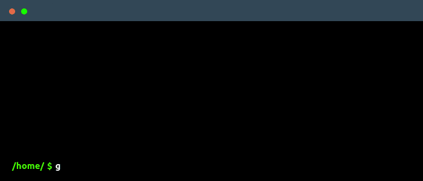
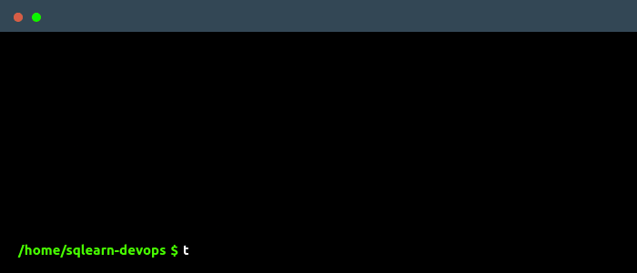
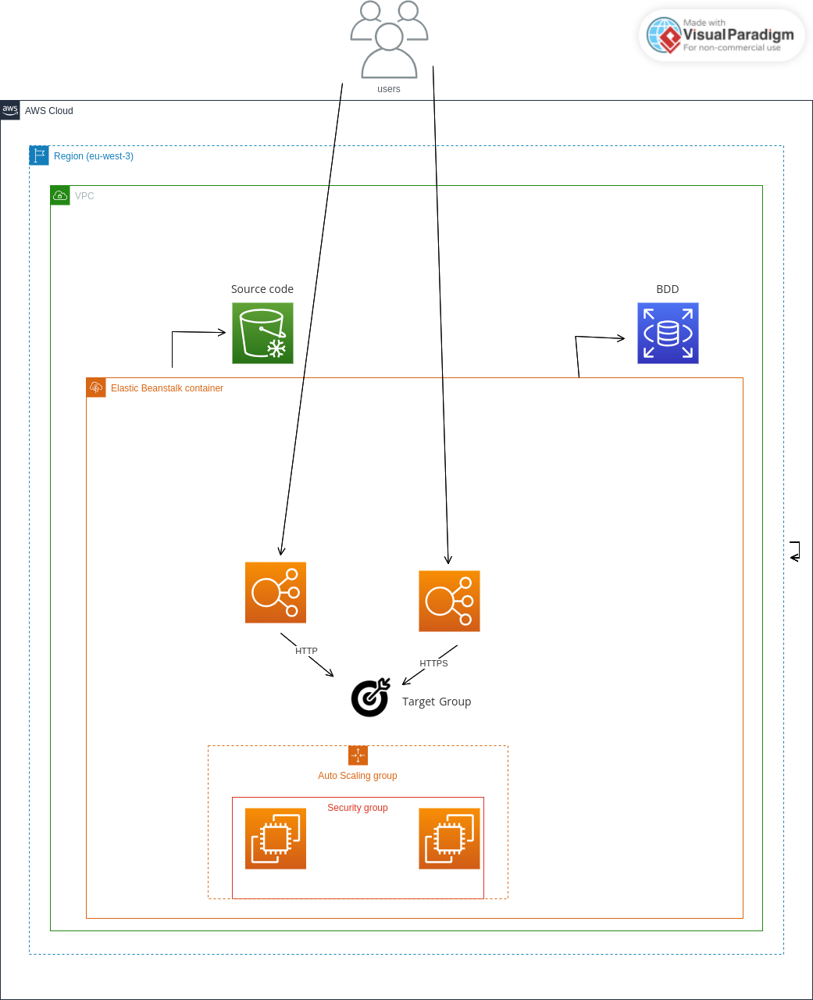

# Problématique

L'entreprise RotourDev est une entreprise de formation en informatique. Elle propose des formations en ligne sur des technologies variées. L'entreprise a récemment décidé de se lancer dans la formation sur les bases de données. Pour cela, elle a créé une nouvelle plateforme de formation en ligne appelée SQLearn.

Cette application est déployée sur Vercel et utilise une base de données VercelDB. Une problématique se pose alors, si Vercel plante, l'entreprise perd toutes les données de ses utilisateurs. Pour éviter cela, l'entreprise a décidé de déployer son application sur AWS et d'utiliser une base de données RDS.

# 📋 Prérequis

## [Terraform](https://learn.hashicorp.com/tutorials/terraform/install-cli)

Terraform est un outil d'infrastructure en tant que code open-source créé par HashiCorp. Il permet aux utilisateurs de définir et de provisionner des infrastructures de datacenter dans un langage de configuration déclaratif connu sous le nom de HashiCorp Configuration Language, ou en utilisant le format JSON.

## [AWS CLI](https://docs.aws.amazon.com/cli/latest/userguide/install-cliv2.html)

L'interface de ligne de commande AWS (AWS CLI) est un outil unifié qui vous permet de gérer vos services AWS. Avec juste une seule interface de ligne de commande, vous pouvez contrôler plusieurs services AWS à partir de la ligne de commande et automatiser eux à travers des scripts.

## [AWS Account](https://aws.amazon.com/fr/console/)

AWS est une plateforme de services cloud sécurisée, évolutive et rentable qui vous permet de créer des applications sophistiquées avec une flexibilité et une agilité sans précédent.


## [Git](https://git-scm.com/downloads)

Git est un système de contrôle de version distribué gratuit et open source conçu pour gérer tout, des petits aux très grands projets, avec rapidité et efficacité.


## [Docker](https://docs.docker.com/get-docker/)

Docker est une plateforme logicielle qui permet de créer, de tester et de déployer des applications rapidement. Docker package une application et ses dépendances dans un conteneur virtuel qui peut s'exécuter sur n'importe quel serveur compatible Docker.


# 📝 Installation

1. Cloner le projet

```bash
git clone git@github.com:ESCAFFRE-Lucas/sqlearn-devops.git
```

2. Se déplacer dans le dossier

```bash
cd sqlearn-devops
```

3. Initialiser Terraform

```bash
terraform init
```

4. Créer un fichier `terraform.tfvars` à la racine du projet et ajouter les variables suivantes

```bash
touch terraform.tfvars
```

```bash
aws_region
route53_zone_id
application_name
application_description
application_environment
db_username
db_password
```



## 🚀 Déploiement

1. Créer l'infrastructure

```bash
terraform apply -auto-approve
```


## 🛠️ Verification

Pour la vérification des ressources AWS, vous pouvez vous connecter à votre compte AWS et vérifier les ressources créées.



## 🛑 Arrêt

1. Supprimer l'infrastructure

```bash
terraform destroy -auto-approve
```


# 📦 Technologies

- [Terraform](https://www.terraform.io/)
- [AWS](https://aws.amazon.com/fr/)
  - [AWS CLI](https://aws.amazon.com/fr/cli/) 
  - [AWS RDS](https://aws.amazon.com/fr/rds/)
  - [AWS Route53](https://aws.amazon.com/fr/route53/)
  - [AWS EC2](https://aws.amazon.com/fr/ec2/)
  - [AWS VPC](https://aws.amazon.com/fr/vpc/)
  - [AWS S3](https://aws.amazon.com/fr/s3/)
  - [AWS IAM](https://aws.amazon.com/fr/iam/)
  - [AWS CloudWatch](https://aws.amazon.com/fr/cloudwatch/)
  - [AWS Load Balancers](https://docs.aws.amazon.com/fr/elasticloadbalancing/)
- [Docker](https://www.docker.com/)
- [MySQL](https://www.mysql.com/)

# 📄 Schema



# 📝 Authors

- [Lucas ESCAFFRE](https://github.com/ESCAFFRE-Lucas/)
- [Anthony CAVAGNE](https://github.com/tonycava/)
